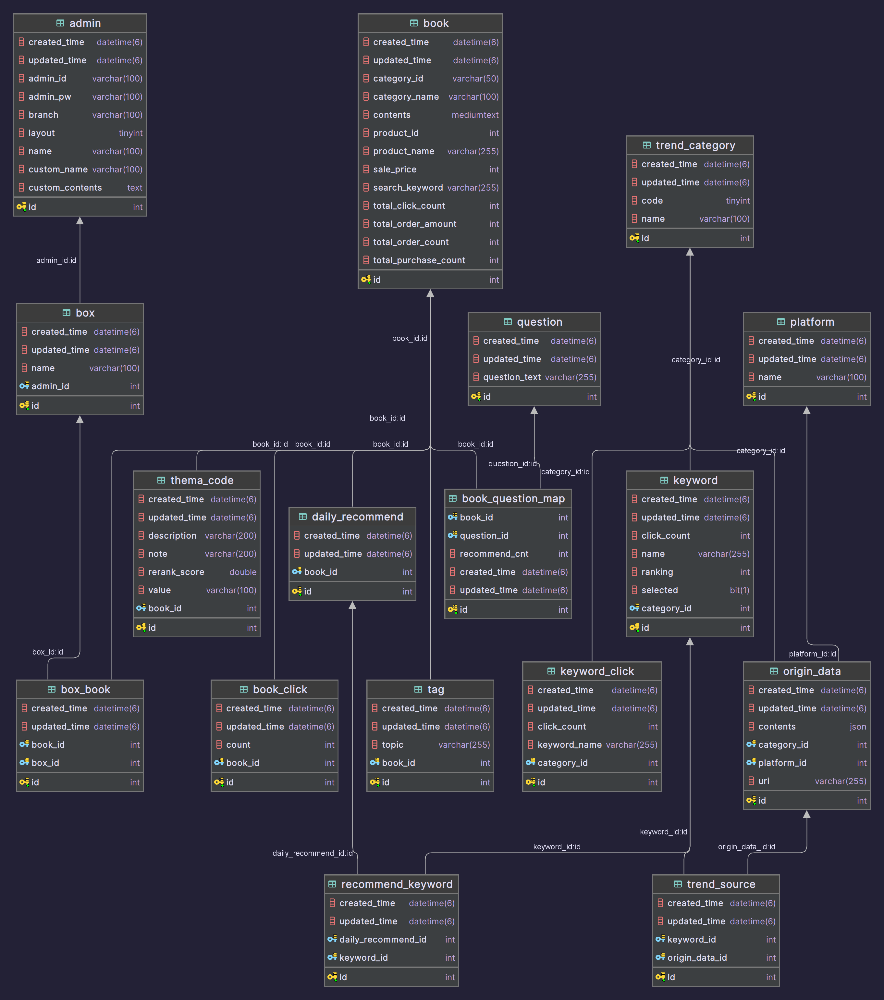
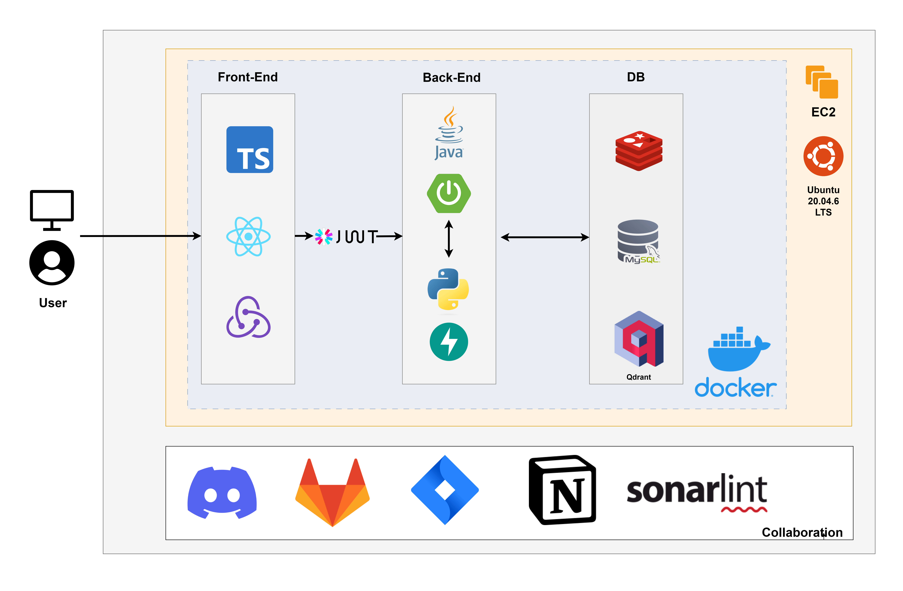
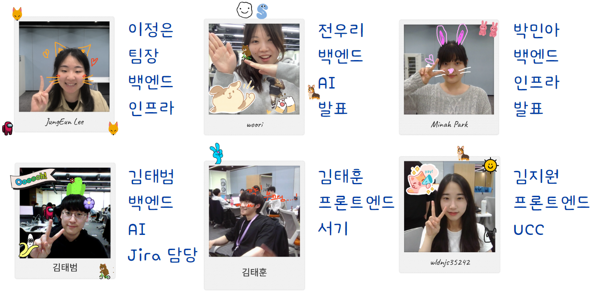
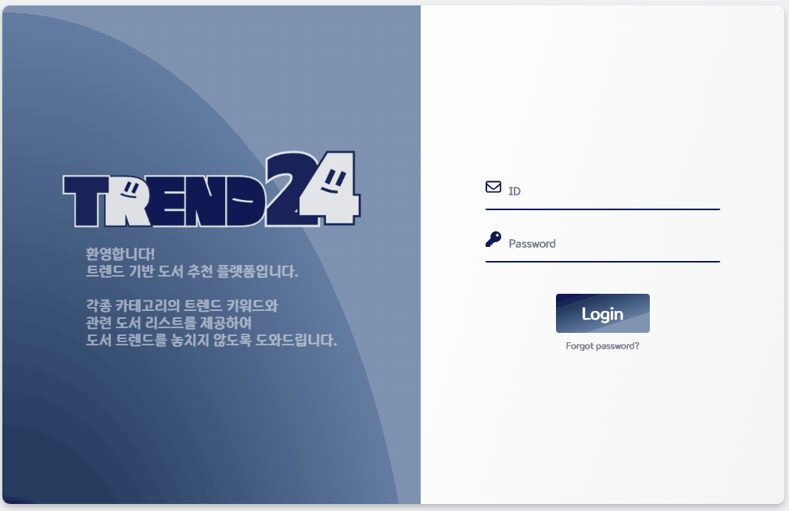
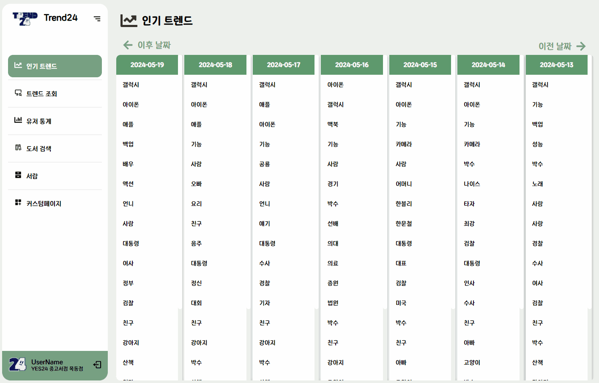
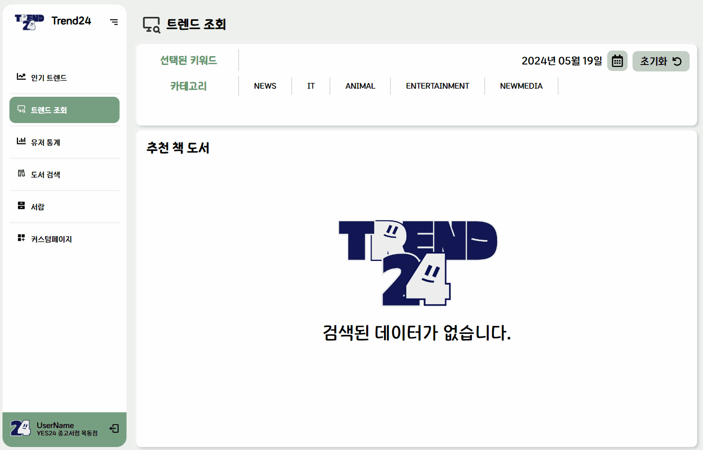

# Trend24

## 프로젝트 소개

> - YES24 기업연계 프로젝트
> - SNS/쇼츠와 같은 다양한 미디어를 통해 최신 이슈와 트렌드를 수집하고, 이를 바탕으로 최신의 이슈 및 트렌드와 관련된 도서를 고객이나 도서 MD에게 제공해주는 서비스

> 프로젝트 주제 배경
> ---
> 최근 SNS와 동영상 플랫폼 등 다양한 미디어 채널을 통해 사회 전반의 이슈와 트렌드가 빠르게 확산되고 있다. 
> 하지만 이러한 실시간 정보를 체계적으로 수집하고 관련 도서를 찾는 것은 쉽지 않다.  
> 이에 따라 도서 MD나 일반 독자들이 최신 이슈와 트렌드에 관한 정보를 손쉽게 얻고, 관련 도서를 추천받을 수 있는 시스템의 필요성이 대두되고 있다. 
> 이에 본 프로젝트에서는 SNS, 동영상 플랫폼 등 다양한 미디어 채널의 실시간 정보를 수집하고 분석하여, 이슈와 트렌드에 따른 도서 정보를 제공하는 서비스를 개발하고자 한다. 
>  

## 개발 기간 및 프로젝트 관리
| 제목 | 내용 |
| :-----: | :-----:|
| 프로젝트 기간 | 2024.04.11 ~ 2024.05.20 |
| 프로젝트 관리 툴 |    |

## 프로젝트 링크

 

 

## ERD

## Project Architecture

## 팀원

# 서비스 및 기능 소개

## MD 페이지

| **로그인 페이지** |
| :-----: |
| 

 |
- 등록된 아이디와 비밀번호를 통해 MD 계정에 로그인 가능합니다.

| **인기 트렌드** |
| :-----: |
| 

 |
- 날짜 별 주요 키워드 확인 가능합니다.
- 키워드에 마우스 포인터를 올리면 해당 티워드가 나온 다른 날짜를 확인 가능합니다.
- 키워드를 틀릭하면 관련 추천 도서 및 정보를 확인 가능합니다.

| **트렌드 조회** |
| :-----: |
| 

 |
- 날짜와 카테고리, 키워드를 자유롭게 선택 가능합니다.
- 선택한 키워드와 관련된 추천 도서들을 확인 가능합니다.

| **유저 통계** |
| :-----: |
| 

 |
- 웹 사용자의 이용 데이터를 그래프와 표 등으로 확인 가능합니다.

| **도서 검색 - 제목으로 검색** |
| :-----: |
| 

 |
- 찾고자 하는 도서의 카테고리를 선택할 수 있습니다.
- 도서를 제목 검색을 통해 찾을 수 있습니다.

| **도서 검색 - 문장으로 검색** |
| :-----: |
| 

 |
- 원하는 문장을 자유롭게 작성하여 문장과 관련된 책을 검색합니다.

| **서랍** |
| :-----: |
| 

 |
- 키워드 추가를 통해 원하는 도서 서랍을 생성 가능합니다.
- 인기 트랜드, 트랜드 조회, 도서 검색에서 저장한 도서를 확인 가능합니다.

| **커스텀 페이지** |
| :-----: |
| 

 |
- 편집을 통해 원하는 위젯을 선택하여 자신만의 커스텀 페이지를 제작할 수 있습니다.

## 유저 페이지

| **서비스 선택 페이지** |
| :-----: |
| 

 |
- 오른쪽 메뉴바를 통해 트랜드별 추천 또는 추억 여행를 선택 가능합니다.
- 로켓을 클릭하여 서비스 페이지에 입장 가능합니다.

| **트렌드별 추천 화면 - 메인 페이지** |
| :-----: |
| 

 |
- 별을 골라 원하는 카테고리의 상세 페이지에 입장 가능합니다.

| **트렌드별 추천 화면 - 상세 페이지** |
| :-----: |
| 

 |
- 워드 클라우드를 통해 카테고리의 키워드를 확인 가능합니다.
- 키워드 추천 책 소개를 통해 책의 상세 정보를 확인 가능합니다.

| **추억 여행 - 메인 페이지** |
| :-----: |
| 

 |
- 원하는 질문을 선택하여 서비스를 이용할 수 있습니다.
- 질문에 대한 답변 도서를 제목 검색 또는 다른 사용자들의 선택 도서 목록을 통해 선택 가능합니다.

| **추억 여행 - 상세 페이지** |
| :-----: |
| 

 |
- 답변한 도서의 정보와 다른 사용자들의 답변들 중에서 유사한 도서들을 확인 가능합니다.

## 개발 환경 및 기술 스택

| 부서 | 개발 환경 및 기술 스택 |
| :-----: | :-----:|
| Front End |     |
| Back End |       	  |
| Data |      |
| Infra |    |
